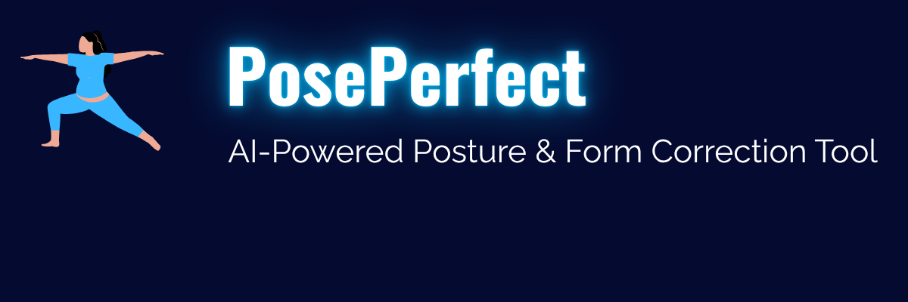

# 🧘‍♀️ PosePerfect: AI-Powered Posture & Form Correction Tool



PosePerfect is an intelligent real-time feedback system that uses computer vision and AI to help users improve their posture and exercise form. Built using Python, MediaPipe, and OpenCV, this tool provides instant visual feedback and logs insights for performance analysis.

---

## 🚀 Demo


---

## 📌 Features

- 🎯 Real-time posture detection using webcam
- 🧠 AI-driven feedback using landmark analysis
- 📊 CSV logging with timestamps for performance tracking
- 🖼️ Visual feedback overlay on the live webcam feed
- 📱 Mobile-ready _(Buildozer setup in progress for Android deployment)_

---

## 🛠️ Tech Stack

**Language:**  
`Python`

**Libraries & Tools:**

- `OpenCV` – Webcam access and image processing
- `MediaPipe` – Pose estimation using AI/ML
- `CSV` & `datetime` – For session logging and timestamping
- `Kivy` + `Buildozer` – _(Planned)_ Mobile app packaging (Android)

---

### 📦 Tool Breakdown

| Tool / Library     | Purpose                               |
| ------------------ | ------------------------------------- |
| `Python`           | Core programming language             |
| `OpenCV`           | Webcam access and image processing    |
| `MediaPipe`        | Real-time pose estimation             |
| `CSV Logger`       | Logs posture feedback with timestamps |
| `Kivy + Buildozer` | For mobile deployment (future-ready)  |

---

## 🖥️ How to Run

1. **Clone the repository**

   ```bash
   git clone https://github.com/akshithaboda10/poseperfect.git
   cd poseperfect

   ```

2. **Create and activate virtual environment**

   ```bash
   python -m venv venv
   venv\Scripts\activate   # On Windows

   ```

3. **Install dependencies**

   ```bash
   pip install -r requirements.txt

   ```

4. **Run the application**

   ```bash
   python app.py

   ```

5. **Exit the webcam**
   Press Q in the webcam window

📁 Folder Structure

poseperfect/
├── app.py # Main application
├── feedback_logic.py # Feedback generation logic
├── pose_detection.py # Pose estimation processing
├── pose_utils.py # Utility functions for posture checks
├── test_cam.py # Test webcam & pose detection
├── feedback_log.csv # Session logs (auto-generated)
├── requirements.txt # Required packages
├── README.md # Project documentation
├── Pose_Demo.gif # Demo animation
├── assets/
│ └── poseperfect_banner.png # Banner image
└── .gitignore # Git ignored files

📚 Citation
If you use this project, feel free to cite it as:

Akshitha Boda. PosePerfect: AI-Powered Posture & Form Correction Tool. GitHub repository. 2025.
https://github.com/akshithaboda10/poseperfect

🤝 Contact

Made with ❤️ by Akshitha Boda

📧 akshithaboda10@gmail.com

🔗 LinkedIn(https://www.linkedin.com/in/akshitha-boda-51839b249/)

🔗 GitHub(https://github.com/akshithaboda10)
